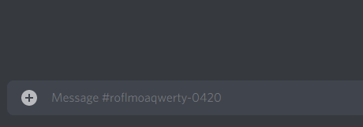

# 📋 Extraits
Les extraits, parfois appelés "messages préenregistrés" ou "tags", sont des messages courants que vous pouvez envoyer dans les fils Modmail avec une seule commande.

## Voir les extraits disponibles
### `!snippets` / `!s <raccourci>`

Pour voir tous les extraits disponibles, utilisez la commande `!snippets`.

Pour voir le texte d'un extrait spécifique, utilisez la commande `!s <raccourci>`.  
Par exemple, pour voir le texte d'un extrait appelé "hi", exécutez `!s hi`.

## Création d'extraits
### `!s <raccourci> <texte>`

#### Exemple
Pour créer un extrait appelé "hi" avec le texte "Bonjour, comment pouvons-nous vous aider ?", utilisez la commande suivante :

`!s hi Bonjour, comment pouvons-nous vous aider ?`

## Utilisation des extraits
### `!!raccourci` / `!!!raccourci`
Dans un fil Modmail, utilisez `!!raccourci` pour envoyer un extrait à l'utilisateur, en remplaçant `raccourci` par le nom de l'extrait.

Pour envoyer un extrait de manière anonyme, utilisez `!!!raccourci`.

*Les préfixes `!!` et `!!!` peuvent être changés avec les options du bot `snippetPrefix` et `snippetPrefixAnon` respectivement.*

#### Exemple
Pour envoyer un extrait appelé "hi", utilisez la commande suivante :

`!!hi`

Pour envoyer ce même extrait de manière anonyme, utilisez la commande suivante :

`!!!hi`

## Édition des extraits
### `!edit_snippet <raccourci> <texte>` / `!es <raccourci> <texte>`

#### Exemple
Pour modifier un extrait appelé "hi" pour dire "Bonjour, comment ça va ?", utilisez la commande suivante :

`!es hi Bonjour, comment ça va ?`

## Suppression des extraits
### `!delete_snippet <raccourci>` / `!ds <raccourci>`

#### Exemple
Pour supprimer un extrait appelé "hi", utilisez la commande suivante :

`!ds hi`
